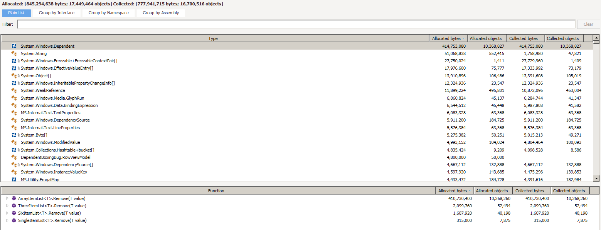

# Description

This is test project for reproducing bug https://connect.microsoft.com/VisualStudio/feedback/details/1691490/boxing-of-system-windows-dependent-in-frugallist-t

A big amout of System.Windows.Dependent is boxed because of styles. I have made example as simple as possible so somethings are not done as in real life application.

Here you can see screenshot from DotMemory MemoryTraffic view:

Also if you have DotMemory application you can view result of profiling in this workspace: https://dl.dropboxusercontent.com/u/67551504/DependentBoxingBug%20%5B2015-08-25%5D%20%5B10-56%5D.dmw
